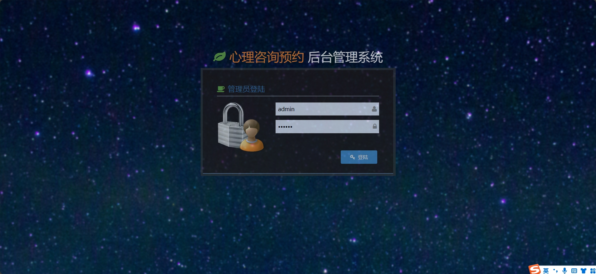
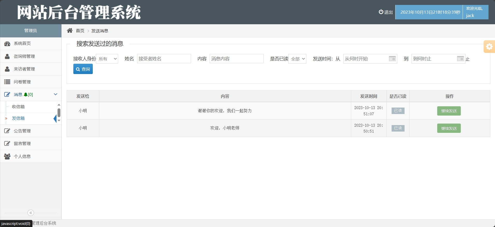
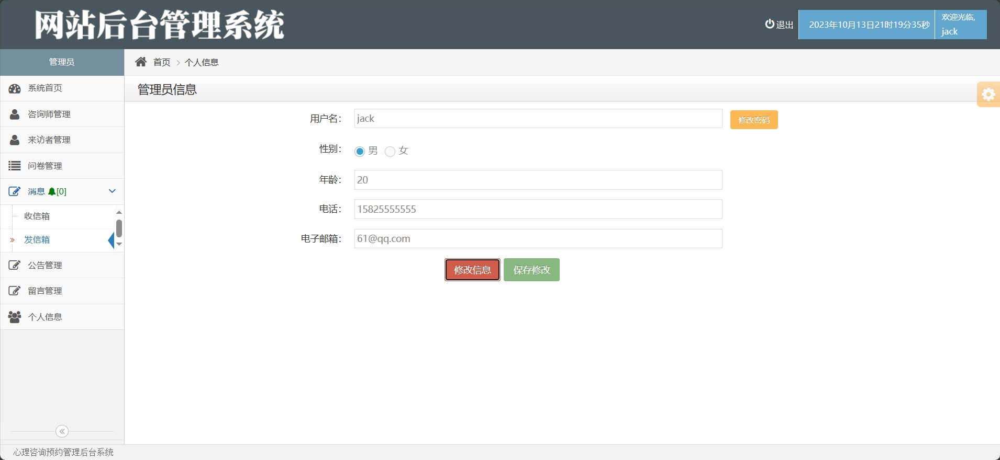
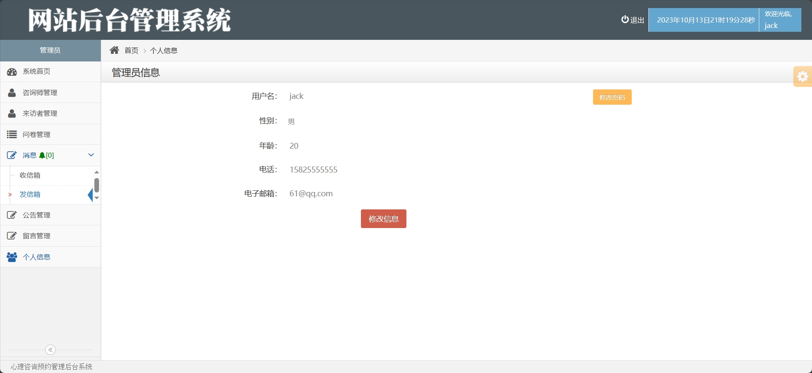
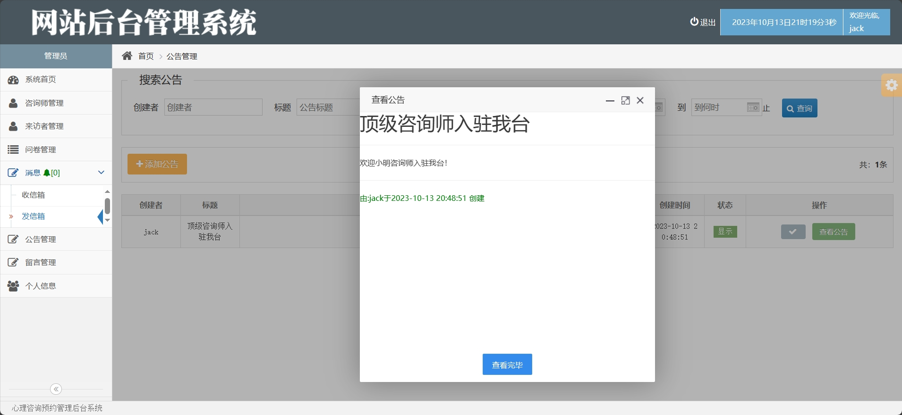
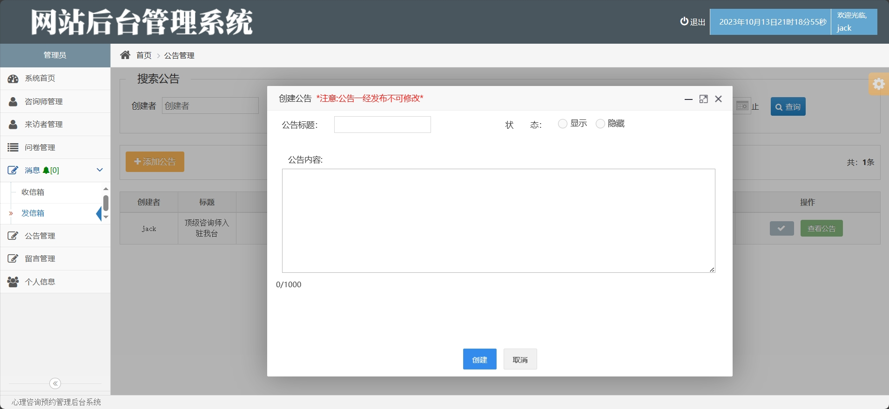
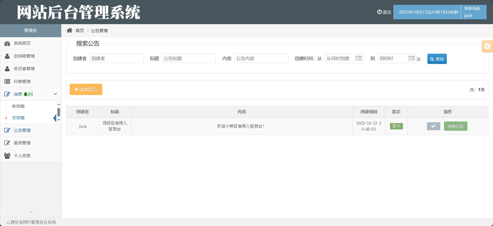

<h1 align="center">基于JSP+Servlet的心理咨询预约系统</h1>

<h4> 完整代码获取地址：从戎源码网（https://armycodes.com/） </h4>
<h4> 作者微信：19941326836 QQ：605739993 QQ群：655392706 </h4>
<h4> 承接计算机毕设、Java毕业设计、Python毕业设计、深度学习、机器学习 </h4>
<h4> 选题+开题报告+任务书+程序定制+安装调试+论文+答辩ppt 一条龙服务 </h4>
<h4> 毕业设计所有选题地址：(https://github.com/Descartes007/allProject) </h4>

## 一、项目介绍

基于JSP+Servlet的心理咨询预约系统：前端 JSP、BootStrap、JQuery、Ajax，后端 Java、Servlet、Mysql，系统角色分为：管理员、咨询师和用户，管理员在管理后台上传咨询、启动和注册相关咨询师、消息发送、公告设置、留言发布等；咨询师可以联系咨询者、阅读消息、留言患者等；用户可以发送消息、查看预约详情、下载咨询文档等。主要功能如下：

### 1、管理员：

- 基本操作：登录、修改密码、获取个人信息、修改个人信息
- 统计模块：咨询师数量统计、用户数量统计、咨询量统计
- 咨询师管理：添加咨询师、筛选咨询师、删除咨询师、获取咨询师列表、查看咨询师详情、启用咨询师、修改咨询师信息
- 用户管理：获取用户列表、筛选用户信息、查看用户详情、启用用户账号
- 问卷管理：添加问卷、筛选问卷信息、删除问卷、获取问卷列表、修改问卷信息
- 消息模块：消息发送、消息接收、消息阅读、消息筛选、获取消息列表、获取消息详情
- 公告管理：添加公告、筛选公告、获取公告列表、查看公告详情、隐藏公告
- 留言管理：筛选留言、获取留言列表、查看留言详情、隐藏留言

### 2、咨询师：

- 基本操作：登录、修改密码、获取个人信息、修改个人信息
- 咨询模块：获取咨询申请列表、接收咨询、上传咨询文档、完成咨询、填写咨询开始信息、联系咨询者、获取咨询记录
- 消息模块：消息发送、消息接收、消息阅读、消息筛选、获取消息列表、获取消息详情
- 公告管理：添加公告、筛选公告、获取公告列表、查看公告详情、隐藏公告
- 留言管理：发布留言、隐藏留言、获取留言列表、获取留言详情、筛选留言

### 3、用户：

- 基本操作：登录、修改密码、获取个人信息、修改个人信息
- 预约模块：获取预约师列表、发起预约、发送消息、获取预约列表、取消预约
- 咨询模块：获取咨询列表、下载咨询文档
- 消息模块：消息发送、消息接收、消息阅读、消息筛选、获取消息列表、获取消息详情
- 公告管理：添加公告、筛选公告、获取公告列表、查看公告详情、隐藏公告
- 留言管理：隐藏留言、获取留言列表、获取留言详情、筛选留言

## 二、环境

- <b>IntelliJ IDEA 2020.3</b>

- <b>Mysql 5.7.26</b>

- <b>Tomcat 9.0.41</b>

- <b>JDK 1.8</b>

## 三、运行截图

